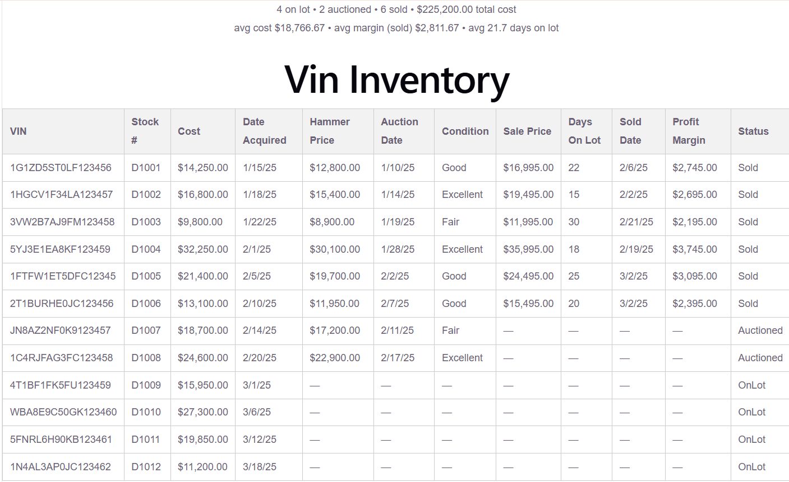

# Vin — Multi-Source Inventory Data Aggregation

1. An ASP.NET Core + EF Core API that merges three mismatched automotive data
   feeds — dealer inventory, auctions, sales — into one clean, VIN-keyed view.
2. Angular and React frontends sit side by side, consuming that identical
   API, built specifically to compare how each framework solves the same
   problem.
3. Underneath it's got real backend teeth:
   - **Window-function deduplication** — a re-auctioned VIN used to produce
     duplicate rows; fixed with
     `ROW_NUMBER() OVER (PARTITION BY Vin ORDER BY AuctionDate DESC)` so only
     the most recent record wins.
   - **A genuine SQL aggregates endpoint** — `GET /api/inventory/stats`
     returns real `COUNT`/`GROUP BY` status breakdowns and `SUM`/`AVG` cost
     and profit-margin figures, not just row-by-row data.
   - **A hand-written T-SQL view** — `dbo.MostRecentAuctionPerVin`, the same
     dedupe logic written directly in SQL as an independent reporting
     artifact, separate from the API's LINQ.
   - **Indexing** — non-clustered indexes on `Vin` across all three tables,
     added and verified against real query plans.
   - **Integration tests against a real database** — xUnit tests that run
     against actual SQL Server LocalDB (not a mock or in-memory fake), each
     isolated in its own rolled-back transaction.



## Prerequisites

- .NET 9 SDK
- Node.js 22+
- SQL Server LocalDB (ships with SQL Server Express/Developer or Visual Studio)

## Running the API

```bash
dotnet ef database update -p src/Vin.Api -s src/Vin.Api
dotnet run --project src/Vin.Api
```

API listens on `http://localhost:5080`. On first run it seeds `VinInventory`
in LocalDB from the JSON files in `src/Vin.Api/Seed/`.

- `GET /api/inventory` — all vehicles, merged across sources
- `GET /api/inventory/{vin}` — single vehicle, 404 if VIN not found
- `GET /api/inventory/stats` — aggregate counts by status, total/average
  cost, and average profit margin/days-on-lot for sold vehicles

## Running the Angular app

```bash
cd src/vin-web
npm install
npx ng serve
```

Open `http://localhost:4200`. The app expects the API to already be running
on `http://localhost:5080`.

## Running the React app

```bash
cd src/vin-web-react
npm install
npm run dev
```

Open `http://localhost:5173`. Same expectation as the Angular app — the API
must already be running on `http://localhost:5080`. Both frontends can run
at the same time; the API's CORS policy allows both origins.

## Running the backend tests

```bash
dotnet test src/Vin.Api.Tests
```

Integration tests against a real LocalDB database (`VinInventoryTest`,
separate from the dev database) — not an in-memory fake — so the tests
actually exercise the window-function dedupe and indexing described above.
Each test runs inside its own transaction, rolled back on teardown, so
nothing persists between runs.

## Resetting the database

```bash
dotnet ef database drop -p src/Vin.Api -s src/Vin.Api
dotnet ef database update -p src/Vin.Api -s src/Vin.Api
```
